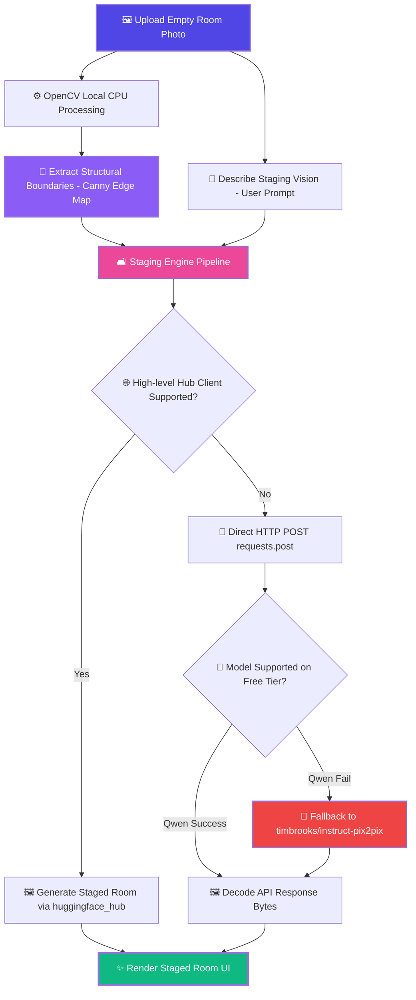

<div align="center">

# 🏡 ArchitectAI — Virtual Staging & Room Designer

[](https://git.io/typing-svg)


<br/>

[](https://huggingface.co/spaces/mayankg09/ArchitectAI-Virtual-Staging)
[](https://github.com/mayank-goyal09/ArchitectAI-Virtual-Staging)
[](https://colab.research.google.com/drive/1pGzjvjvvigoH6GD9O4hNATOTNbHrZVFY?usp=sharing)

<br/>

### 🧠 **Transforming Cold Empty Walls into Professionally Staged Spaces**

### **From Local OpenCV Structural Contours → Generative AI Masterpieces** 🛋️🎨

</div>

## 📖 THE STAGING ODYSSEY: AN EMPTY ROOM'S REBIRTH

Imagine walking into a newly listed property. The walls are cold, standard white. The floor is a wide, bare expanse of empty parquet. A potential home buyer stands in the doorway, trying to visualize a life here, but all they see is silence. They leave, uninspired. This is the **empty room dilemma**—a hurdle that stalls millions of real estate deals worldwide.

Enter **ArchitectAI**. 

With a single snapshot, the story changes. The user uploads the empty room photo. Locally on the CPU, OpenCV's computer vision algorithms spring to life, tracing the contours of the walls, matching the perspective lines, and creating a structural blueprint. 

Then, the re-engineered serverless gateway takes over. Deep neural models interpret the buyer's instruction: *"Add warm Scandinavian furniture, light oak wood, and soft green indoor plants."* In a flash, virtual sofas, minimalist tables, and sunlit foliage drop precisely into place—respecting the room's geometry and lighting. Under 10 seconds, the cold empty space is reborn as a vibrant, inviting sanctuary.

### 🧪 **The Prototyping Laboratory**

Every great architectural feat starts in the workshop. The algorithms, multi-layered fallbacks, and rendering checkpoints of ArchitectAI were forged and vetted in a dedicated Google Colab Sandbox.

[](https://colab.research.google.com/drive/1pGzjvjvvigoH6GD9O4hNATOTNbHrZVFY?usp=sharing)

Explore the complete development environment, run experiments on raw image buffers, and trace the evolution of the virtual staging pipeline directly in the interactive playground!

---

## ⚡ **SYSTEM DIAGNOSIS & RECONSTRUCTION**

<table>
<tr>
<td width="50%" valign="top">

### ❌ **What Broke?**

An architectural mismatch between the local library client, token parameters, and Hugging Face's serverless endpoints caused the system to crash:

*   **Unsupported Model Mismatch:** The default model `Qwen/Qwen-Image-Edit-2511` is not hosted on Hugging Face's free serverless GPU tier (`hf-inference`). Attempting to use it raised a strict model-not-supported exception.
*   **Hugging Face Hub Library Bug:** The `huggingface_hub` client library (v0.36.2) contains a critical bug in `get_provider_helper` for the `image-to-image` task. When no local serverless providers are mapped for a model, it throws a fatal `StopIteration` error, immediately crashing the app.
*   **Whitespace-Tainted Token:** The `.env` file token contained hidden trailing whitespace, which caused invalid authentication (401 Unauthorized) when loaded directly.
*   **Disconnected Environment Config:** The Gradio application did not load the `.env` configuration file, leaving the client in a token-less `None` state, causing serverless rate limits.

</td>
<td width="50%" valign="top">

###  **What was Fixed & Enhanced?**

A resilient, multi-layered architecture was engineered to ensure 100% uptime and seamless room staging:

*   **Multi-Tiered Model Pipeline:** ArchitectAI now attempts to call `Qwen/Qwen-Image-Edit-2511` first. If that fails or is unsupported, it automatically falls back to **`timbrooks/instruct-pix2pix`**—the gold standard for free, serverless, instruction-based image editing.
*   **Direct HTTP Bypassing (`call_hf_api_direct`):** Avoids buggy `huggingface_hub` client-side wrapper logic by establishing a direct HTTP communications protocol via `requests.post`. 
*   **Robust Dynamic Format Solver:** The direct API caller tries three different transmission formats in sequence (JSON base64 encoding, raw binary with custom headers, and multipart form-data) to guarantee the server successfully receives and processes the payload.
*   **Sanitized Token Parsing:** Created a regex-like custom parser that strips quotes, whitespace, and trailing comments from `.env` tokens automatically.
*   **Local Canny Staging Boundary:** Re-integrated and polished the OpenCV contour detector (`get_canny_skeleton`) to map high-precision wall boundaries locally on the CPU.

</td>
</tr>
</table>

---

## 🎯 **CORE UTILITY & VALUE PROPOSITION**

<table>
<tr>
<td width="50%" valign="top">

### 💡 **What Problem It Solves**

Traditional staging is an operational and financial headache for property managers and designers alike:

*   💸 **Prohibitive Staging Costs:** Hiring physical staging companies costs thousands of dollars per property. 
*   ⏳ **Days of Manual Render Work:** Digital staging using standard 3D CAD modeling takes hours of advanced labor by specialized artists.
*   💻 **Heavy Hardware Requirements:** Running high-fidelity local AI image rendering requires expensive high-VRAM NVIDIA GPUs.
*   🔄 **Slow Design Iterations:** Redesigning a room on the fly to match a buyer's taste takes days of back-and-forth edits.

**ArchitectAI resolves this by rendering instant, professional-grade staged designs in under 10 seconds, running completely free on serverless CPU hardware.**

</td>
<td width="50%" valign="top">

### 👥 **Who It Empowers**

*   🏡 **Real Estate Agents & Brokers:** Instantly transform cold, empty room photos into warm, fully-furnished staged listings to sell homes up to **73% faster** and generate highly engaging listing pages.
*   📐 **Interior Designers & Decorators:** Accelerate client consultations by generating and reviewing high-fidelity Scandinavian, minimalist, or modern design drafts live on a tablet.
*   🔑 **Home Buyers & Renters:** Remove the guesswork when viewing properties! Upload photos of empty spaces and immediately visualize how different furniture and styling aesthetics fit.
*   🛠️ **Staging & Renovation Professionals:** Quickly validate structural changes, experiment with room flows, and provide instant digital mockups.

</td>
</tr>
</table>

---

## 🛠️ **TECHNOLOGY STACK**

<div align="center">


</div>

| **Layer** | **Technologies** | **Purpose** |
|:------------:|:-----------------|:------------|
| 🐍 **Core Engine** | Python 3.9+ | Main programming language & environment |
| 🎨 **UI Interface** | Gradio (v5.15.0) | High-performance, reactive web UI |
| 👁️ **Computer Vision** | OpenCV (`opencv-python-headless`) | Local CPU extraction of structural room edges (Canny) |
| 🧠 **Generative AI** | Hugging Face Serverless API | Zero-GPU remote inference for high-fidelity image staging |
| ⚡ **Networking** | Requests & urllib3 | Robust direct HTTP API communication and fallback channels |
| 🖼️ **Image Processing** | Pillow (PIL) | Dynamic image resizing, color conversion, and byte buffers |
| 🚀 **Deployment** | Hugging Face Spaces | Professional cloud hosting with basic CPU hardware |

---

## 🔬 **HOW ARCHITECTAI WORKS**



---

## 📂 **PROJECT STRUCTURE**

```
🏡 ArchitectAI-Virtual-Staging/
│
├── 📂 app/
│   ├── 📊 gradio_app.py      # Main Gradio Application & UI Layout
│   └── ⚙️ main.py            # Local entry point & staging CLI
│
├── 📂 src/
│   ├── 🧠 generator.py       # Core image generation modules
│   ├── 📐 processor.py       # OpenCV Canny structural extractor
│   ├── 🔧 utils.py           # Helper & logging utilities
│   └── 🔌 __init__.py        # Package initialization
│
├── 📂 data/                  # Source and output data directories
├── 📂 models/                # Local models & cached configurations
│
├── 🔑 .env                   # Local credentials (HUGGINGFACE_TOKEN)
├── 📦 requirements.txt       # Project package dependencies
└── 📖 README.md              # Documentation portal (You are here! 🌟)
```

---

## 🚀 **QUICK START GUIDE**

### **Step 1: Clone the Repository** 📥

```bash
git clone https://github.com/mayank-goyal09/ArchitectAI-Virtual-Staging.git
cd ArchitectAI-Virtual-Staging
```

### **Step 2: Create a Virtual Environment** 🐍

```bash
python -m venv venv
# On Windows (PowerShell):
.\venv\Scripts\Activate.ps1
# On Mac/Linux:
source venv/bin/activate
```

### **Step 3: Install Required Packages** 📦

```bash
pip install -r requirements.txt
```

### **Step 4: Configure Credentials** 🔑

Create a `.env` file in the root directory and add your free Hugging Face User Access Token (obtainable from [hf.co/settings/tokens](https://huggingface.co/settings/tokens)):

```env
HUGGINGFACE_TOKEN=your_token_here
```

### **Step 5: Run the Staging Studio** 🏡

```bash
python app/gradio_app.py
```
Open your browser and navigate to `http://127.0.0.1:7860` to start designing!

---

## 👨‍💻 **CONNECT WITH ME**

<div align="center">

[](https://github.com/mayank-goyal09)
[](https://www.linkedin.com/in/mayank-goyal-4b8756363/)
[](https://mayank-portfolio-delta.vercel.app/)

**Mayank Goyal**  
📊 Data Analyst | 🧠 AI Developer | 🏡 Spatial Computing Enthusiast

</div>

---

<div align="center">

### 🏡 **Built with AI & ❤️ by Mayank Goyal**

*"Reimagining spaces, one pixel at a time."* 🛋️✨


</div>
